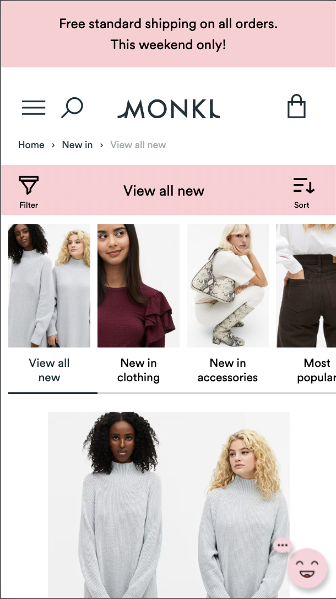

# Procesverslag
**Auteur:** -Dionysha van Wijhe-

Markdown cheat cheet: [Hulp bij het schrijven van Markdown](https://github.com/adam-p/markdown-here/wiki/Markdown-Cheatsheet). Nb. de standaardstructuur en de spartaanse opmaak zijn helemaal prima. Het gaat om de inhoud van je procesverslag. Besteedt de tijd voor pracht en praal aan je website.

## Bronnenlijst
1. https://www.monki.com/en_eur/index.html
2. https://fonts.google.com/
3. https://www.a11yproject.com/posts/2013-01-11-how-to-hide-content/
4. https://www.pexels.com/search/outfit%20women/

## Eindgesprek (week 7/8)

-dit ging goed & dit was lastig-

**Screenshot(s):**

-screenshot(s) van je eindresultaat-

## Voortgang 3 (week 6)

-same as voortgang 1-

## Voortgang 2 (week 5)

### Stand van zaken

-dit ging goed & dit was lastig-

Het gaat over het algemeen wel goed, heb soms alleen nog de neiging om onnodig dingen in mijn css te herhalen.

**Screenshot(s):**

-screenshot(s) van hoe ver je bent met korte uitleg-

Alles op de homepage is ongeveer klaar, behalve de footer.

### Agenda voor meeting

-samen met je groepje opstellen-

| Dionysha       | Ashley             | Daan               | Allyssa.         |
| ---            | ---                | ---                | ---              |
| Footer         |                    |                    |                  |
| img verplaatsen|                    |                    |                  |
| ...            | ...                | ...                | ...              |

### Verslag van meeting

-na afloop snel uitkomsten vastleggen-

- 
- 
-

## Voortgang 1 (week 3)

### Stand van zaken

-dit ging goed & dit was lastig-

- Tot nu toe was alles redelijk makkelijk
- Ik weet alleen niet wat ik met de footer moet doen (vraag tijdens voortgangsgesprek)

**Screenshot(s):**

-screenshot(s) van hoe ver je bent met korte uitleg-

Ik ben bijna klaar met de html en css van de homepage

### Agenda voor meeting

-samen met je groepje opstellen-

| Dionysha       | Ashley             | Daan               | Allyssa.         |
| ---            | ---                | ---                | ---              |
| Footer         | Achtergrond img    | position absolute  | Tekst in Header  |
|                |                    | kopie van site     | Pop up uitwerken |
| ...            | ...                | ...                | ...              |

### Verslag van meeting

-na afloop snel uitkomsten vastleggen-

- Footer hoeft nog niet uitgewerkt, mag eerst een uitgeklapte versie zijn 
- Css filters om achtergrond bij te werken
- svg bestandjes gebruiken voor bijvoorbeeld icoontjes 
- em gebruiken in plaats van px
- Ervoor zorgen dat de content op de website meeschaalt

## Breakdownschets (week 1)

-uitwerken voor de 1e werkgroep - eind van de eerste week-

## Intake (week 1)
-uitwerken voor de kick-off werkgroep - begin van de eerste week-

**Je startniveau:** -blauw-

**Je focus:** -surface plane-

**Je opdracht:** -"https://www.monki.com/en_eur/index.html"-

**Screenshot(s) van de eerste pagina (small screen):**

**Screenshot(s) van de tweede pagina (small screen):**

